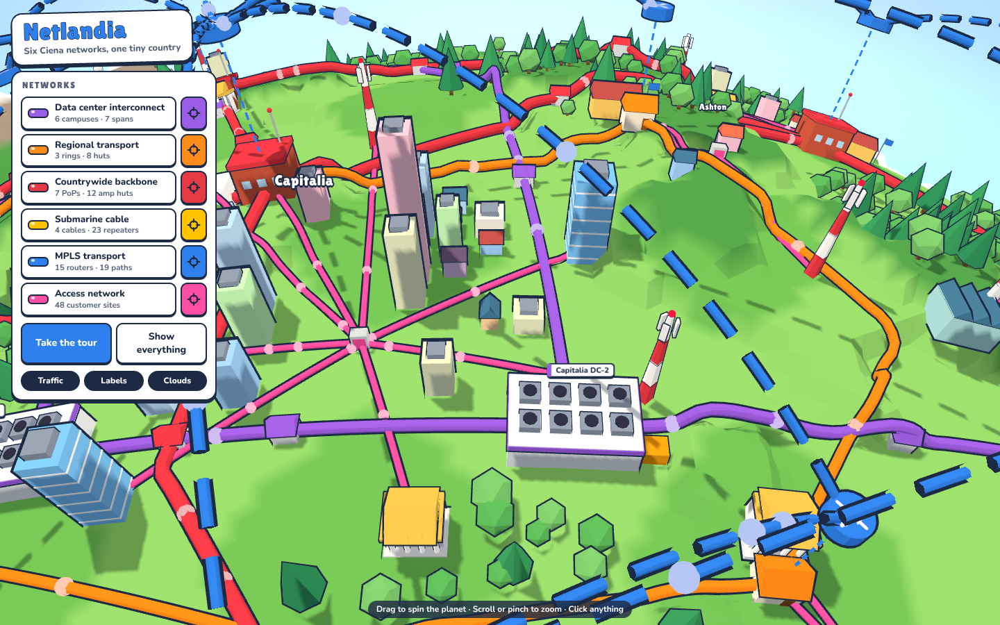
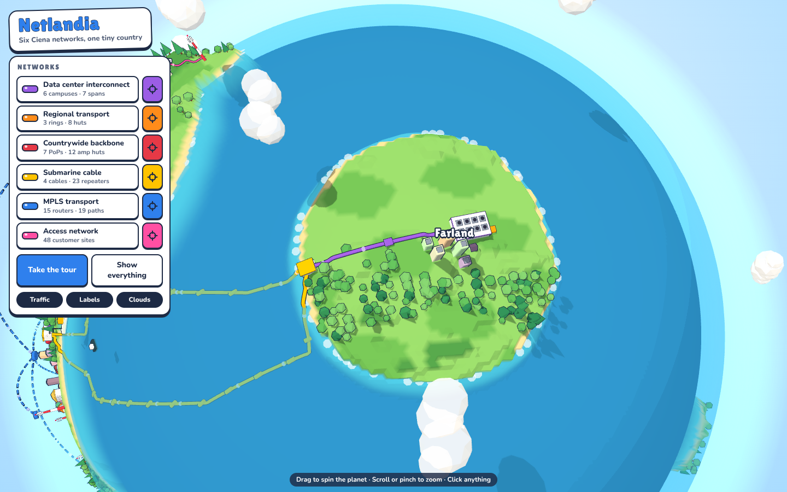

# Ciena Explorer — Netlandia

A cartoon 3D map of a small made-up country on a tiny round planet, with six kinds
of Ciena network drawn on it. Spin the planet all the way round, toggle each network
on and off, fly to one, take the guided tour, or click any building to see what it
is, what equipment it runs and what it connects to. Packets run along every link.


| Zoomed in, the horizon curves away | Submarine cables to Farland, over the planet's edge |
|---|---|
|  |  |



## The planet

The country is laid out on a flat map (`js/world.js`) and then wrapped onto a sphere
of radius 100: distance from the map centre becomes distance along the planet's
surface. Netlandia covers the near side. Farland, Westerland, a small atoll and two
polar ice sheets are on the far side, and the trans-ocean cables run over the
horizon to Farland's landing station and cloud region. Models are stood upright on
the curved ground, so buildings and trees are not stretched.

Zoomed out you look straight down at the whole globe; as you zoom in the camera
tilts toward the horizon, so the ground curves away in front of you. The sun follows
the view, so whatever side you are looking at is in daylight.

## The six networks

| layer | colour | what's on the map | example Ciena gear |
|---|---|---|---|
| Data center interconnect | purple | 5 home DC campuses plus Farland's cloud region, reached over the subsea cables | Waveserver 5, WaveLogic 6 Extreme |
| Regional transport | orange | 3 protected rings (Capitalia, Portsea, Isla Verde) with ring huts in each town | 6500 Packet-Optical |
| Countrywide backbone | red | 7 ROADM PoPs in a mesh, with in-line amplifier huts along the long spans | 6500 / RLS line system |
| Submarine cable | yellow | 4 cables on the sea floor, landing stations and repeaters; two cross to Farland on the far side of the planet | GeoMesh Extreme |
| MPLS transport | blue | 15 core and aggregation routers floating above their sites, LSPs as dashed arcs in the sky | 8100 Coherent Routers, 5100 series |
| Access network | pink | 48 customer sites — banks, cell towers, offices, hospitals, schools, factories, hotels — on access nodes per town | 3900 / 5100 series NIDs and routers |

The product names are illustrative placements, not a real network design.

## Run it

No build step and no dependencies; three.js r160 is vendored in `vendor/` so the
page works offline.

```sh
python3 -m http.server 8765     # then open http://localhost:8765/
node --test test/world.test.mjs
node build.mjs                  # single-file page -> dist/netlandia.html
```

`dist/netlandia.html` loads three.js r160 from jsDelivr and has everything else
inlined, so it can be shared as one file.

## Controls

- Drag (one finger on a phone) spins the planet, any direction, all the way round.
  Scroll or pinch zooms.
- Click a layer to show or hide it; the target button beside it isolates that layer
  and flies to it.
- Click anything on the map for its card. The links to other sites jump the camera there.
- **Take the tour** steps through all six layers with a caption for each. Esc stops it.

## Code

| file | what it does |
|---|---|
| `js/world.js` | pure data: the flat-map-to-planet projection, terrain height, towns, every node and link, generated access sites, amplifiers and repeaters |
| `js/scene.js` | three.js: the planet, sea and atmosphere, towns and trees (instanced), equipment models, cables, boats, wind farm, clouds |
| `js/main.js` | planet camera and controls, layer state, packets, labels, picking, info card, tour |
| `css/net.css` | the HUD |
| `test/world.test.mjs` | data checks: links resolve, equipment and terrestrial fibre stay on dry land, subsea cables stay at sea, the projection round-trips |
| `build.mjs` | bundles everything into `dist/netlandia.html`, and fails if two modules declare the same top-level name |
| `vendor/` | three.js r160 and OrbitControls (MIT) |

To add a site, add a node in `PLACED` and links in `LINKS` in `js/world.js`; the
tests will tell you if it landed in the sea.
