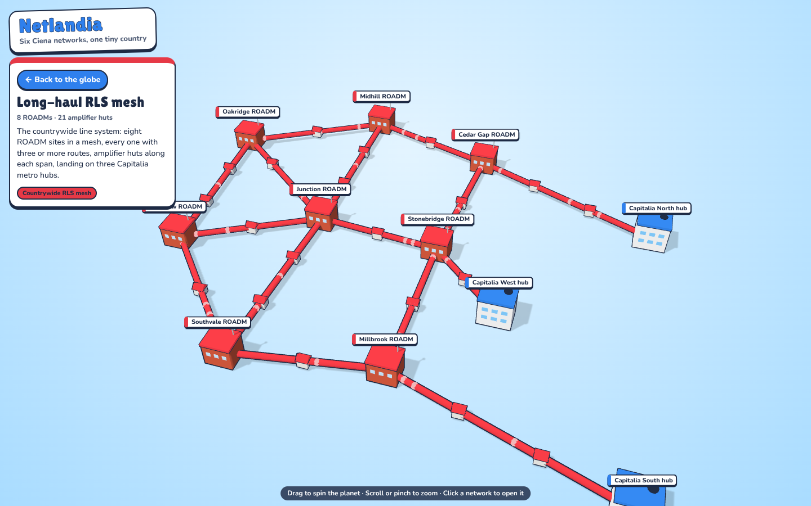
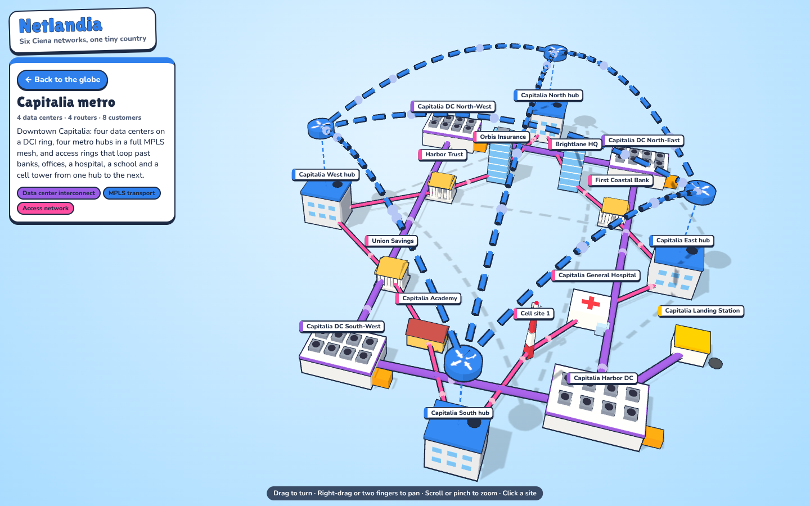

# Ciena Explorer — Netlandia

A cartoon 3D map of a small made-up country on a tiny round planet, with six kinds
of Ciena network drawn on it. Spin the planet all the way round, then click one of the
three major networks to open it on its own in open space, where every site can be
clicked for its equipment and connections. Packets run along every link.


## The planet

The country is laid out on a flat map (`js/world.js`) and then wrapped onto a sphere
of radius 100: distance from the map centre becomes distance along the planet's
surface. Netlandia covers the near side. Farland, Westerland, a small atoll and two
polar ice sheets are on the far side, and the trans-ocean cables run over the
horizon to Farland's landing station and cloud region. Models are stood upright on
the curved ground, so buildings and trees are not stretched.

Zoomed out you look straight down at the whole globe; as you zoom in the camera
tilts toward the horizon, so the ground curves away in front of you. The sun follows
the view, so whatever side you are looking at is in daylight.

## How the country is laid out

The networks sit in their own parts of the map so they don't pile up on each other:

- **West: regional rings.** Two rings through the small western towns, each starting on
  one backbone ROADM and ending on a different one, so no town hangs off a single hub.
- **Middle: the countrywide RLS mesh.** Eight ROADM towns in a triangulated mesh, every
  site with three or more routes out and amplifier huts along each span.
- **East: Capitalia.** The skyline, four data centers on a DCI ring around downtown, and
  four metro hubs where the mesh lands, joined by a full MPLS mesh in the sky. Access
  rings loop between the skyscrapers from one hub to the next.

| The RLS mesh on its own | Downtown Capitalia |
|---|---|
|  |  |

## The six networks

| layer | colour | what's on the map | example Ciena gear |
|---|---|---|---|
| Data center interconnect | purple | 4 Capitalia campuses on a ring around downtown, plus Isla Verde and Farland over the subsea cables | Waveserver 5, WaveLogic 6 Extreme |
| Regional transport | orange | 2 dual-homed rings in the west and the Isla Verde ring | 6500 Packet-Optical |
| Countrywide RLS mesh | red | 8 ROADMs, each with 3+ routes, 24 amplifier huts, landing on 3 Capitalia hubs | RLS with WaveLogic 6 |
| Submarine cable | yellow | 4 cables on the sea floor, landing stations and repeaters; two cross to Farland on the far side of the planet | GeoMesh Extreme |
| MPLS transport | blue | 4 Capitalia hub routers in a full mesh, plus a path to Isla Verde, drawn as arcs in the sky | 8100 Coherent Routers, 5100 series |
| Access network | pink | 16 banks, offices, hospitals, schools and cell towers on rings that run hub to hub, never on a spur | 3900 / 5100 series NIDs and routers |

The product names are illustrative placements, not a real network design.

## Run it

No build step and no dependencies; three.js r160 is vendored in `vendor/` so the
page works offline.

```sh
python3 -m http.server 8765     # then open http://localhost:8765/
node --test test/world.test.mjs
node build.mjs                  # single-file page -> dist/netlandia.html
```

`dist/netlandia.html` loads three.js r160 from jsDelivr and has everything else
inlined, so it can be shared as one file.

## Two views

**The globe** shows the whole country as scenery, and only three things on it are
clickable: the **Submarine network**, the **Long-haul RLS mesh** and the **Capitalia
metro**. Hovering any cable or site of one (or anywhere over downtown, for the metro)
lights that whole network up; clicking it, or its entry in the panel, opens it.

**A network on its own.** The globe goes away and just that network floats in open
space: its sites, cables, amplifiers or repeaters, and the traffic on them, with no
terrain or buildings. Every site is clickable for its details. **Back to the globe**
(or the browser's back button, or Esc) returns.



Each drill-down has its own address, `#submarine`, `#longhaul` or `#metro`, so a link
can open straight into one, and a separate page can later take over that address.

## Controls

- Globe: drag (one finger on a phone) spins the planet, any direction, all the way
  round; scroll or pinch zooms.
- Drill-down: drag turns, right-drag or two fingers pan, scroll or pinch zooms.

## Code

| file | what it does |
|---|---|
| `js/world.js` | pure data: the three major networks and what each owns, the flat-map-to-planet projection, terrain height, towns, every node and link, generated access sites, amplifiers and repeaters |
| `js/scene.js` | three.js: the planet, sea and atmosphere, towns and trees (instanced), equipment models, cables, boats, wind farm, clouds |
| `js/detail.js` | the drill-down view: one network laid flat in open space, with its own lights and traffic |
| `js/main.js` | globe camera, the three clickable networks, switching views, labels, picking, the site card |
| `css/net.css` | the HUD |
| `test/world.test.mjs` | data checks: links resolve, gear and fibre stay on land, subsea cables stay at sea, no two cables run alongside each other, every ROADM has 3+ routes, no customer is on a spur, each network keeps to its zone |
| `build.mjs` | bundles everything into `dist/netlandia.html`, and fails if two modules declare the same top-level name |
| `vendor/` | three.js r160 and OrbitControls (MIT) |

To add a site, add a node in `PLACED` and links in `LINKS` in `js/world.js`; the
tests will tell you if it landed in the sea.
