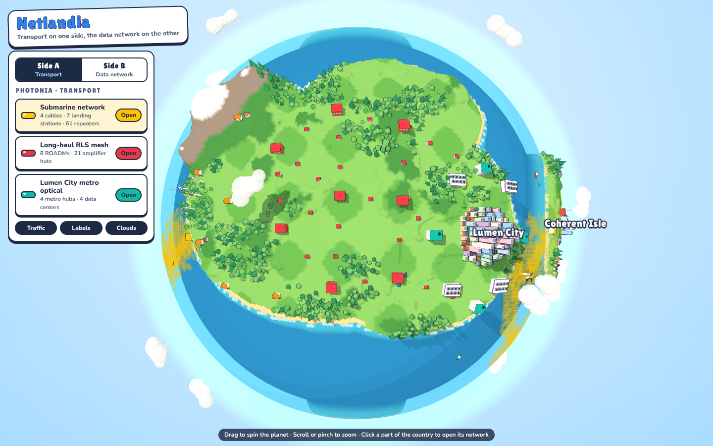
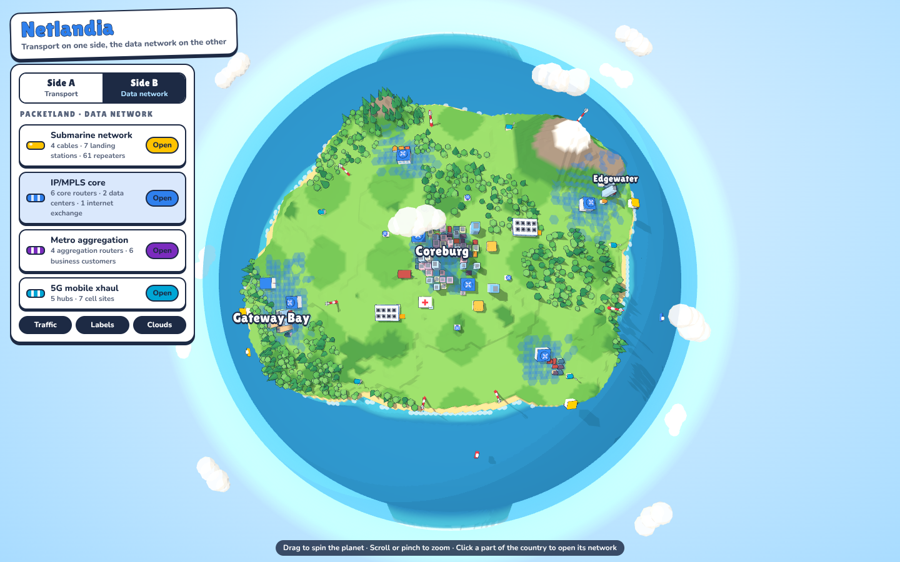
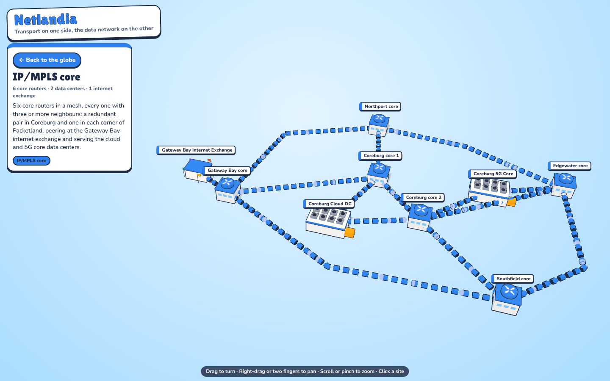
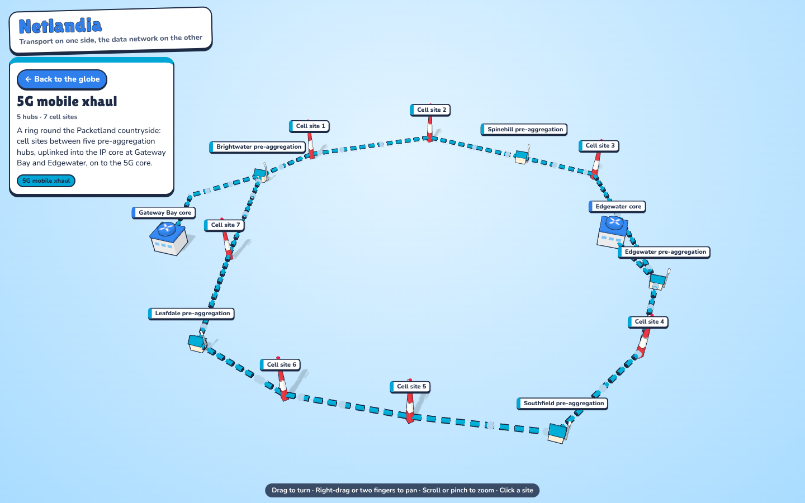
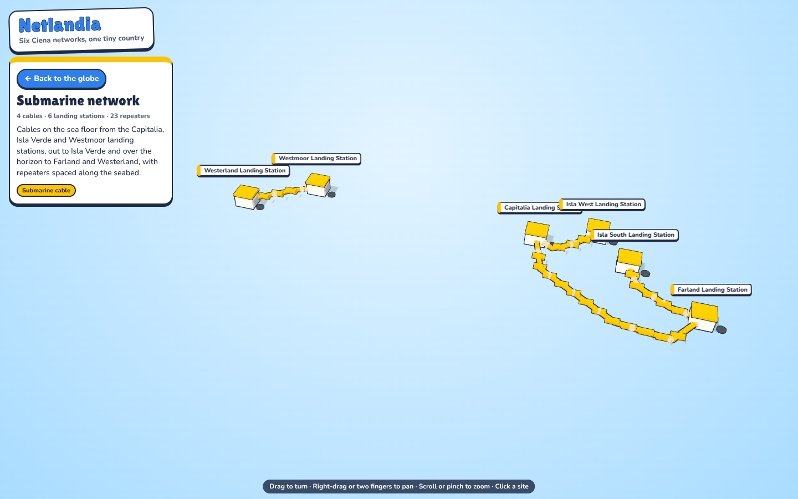
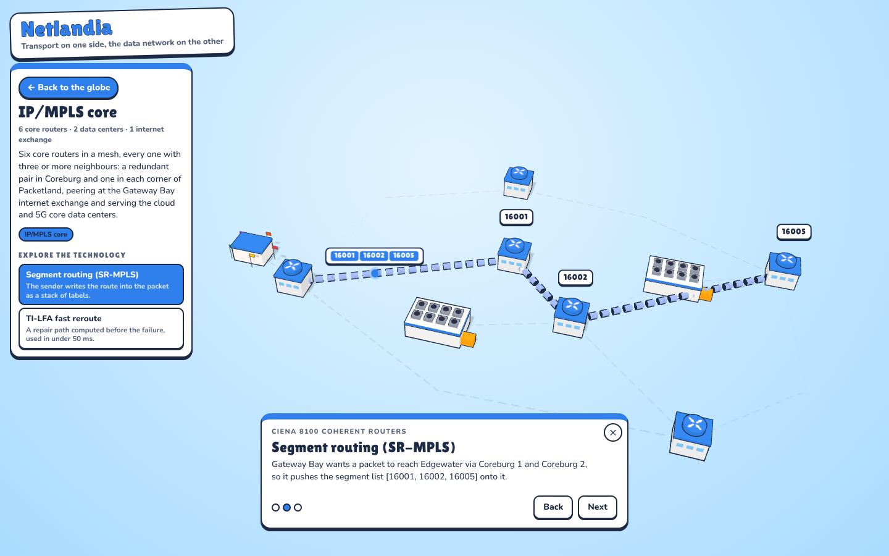
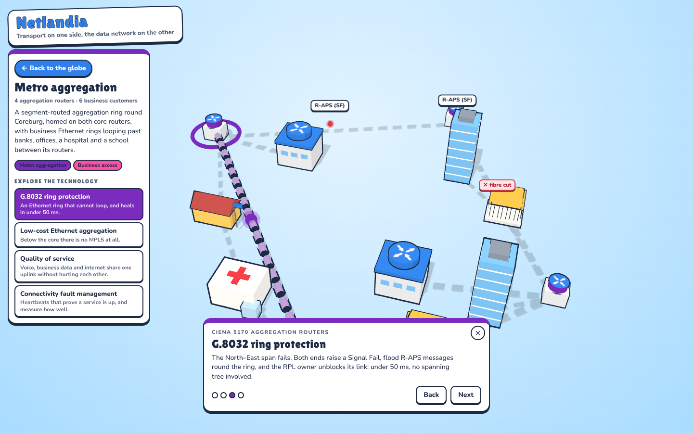

# Ciena Explorer — Netlandia

A cartoon 3D globe called Netlandia, with a country on each face. **Side A**, Photonia, carries the
transport networks. **Side B**, Packetland, carries the data network that rides on
them. Spin the planet all the way round, or flip sides from the panel, then click
one of the six major networks to open it on its own in open space, where every
site can be clicked for its equipment and connections. Packets run along every link.

| Side A: transport | Side B: data network |
|---|---|
|  |  |

## Two ways to read it: Explorer and Engineer

The switch under the title picks how the map is labelled, and the choice is remembered.

| | Explorer | Engineer |
|---|---|---|
| for | an introduction to networking: no acronyms, no part numbers | people who already know the trade |
| look | the board game: sticker cards, rounded type, a daylight sky, whales and an airliner | a flat, dark console: plain type, mono labels, no toys |
| networks | *Countrywide light highway*, *Internet core*, *Mobile phone network*… | *Long-haul RLS mesh*, *IP/MPLS core*, *5G mobile xhaul*… |
| sites | *light junction*, *booster hut*, *collector router*, *beach cable station* | *RLS ROADM site*, *RLS amplifier hut*, *aggregation router*, *cable landing station* |
| site card | what the place does and what is inside, in plain words | its role and the Ciena equipment in it |
| explainers | **Learn how it works**: data travels as light, many colours in one fibre (DWDM, in plain words), what a packet is, finding another way, who goes first, your phone call's journey | **Explore the technology**: CDC ROADMs, mesh restoration, SR-MPLS, TI-LFA, G.8032, QoS, CFM… |

Explorer's words live in `js/vocab.js` and its explainers in `js/basics.js`; a test
checks that nothing Explorer prints uses the trade's acronyms (the DWDM topic, which
is there to introduce one, is the exception). A link to an explainer only one mode
has, such as `#ipcore.sr`, switches to that mode.

## The two sides

The globe is a toy world, not a diagram: nothing is wired up on it. The equipment
stands in the landscape as landmarks (a data center campus, a landing station on
the beach, amplifier huts up the mountain road, cell towers on the hills), and each
network is a **region** of its country. Hover a region and the ground there tints
in that network's colour and its landmarks lift; click it to open the network.
An airliner circles the planet between the two countries.

**Side A, Photonia (transport)** is laid out in three bands so the networks don't
pile up: regional rings through the western towns, the countrywide RLS mesh across
the middle, and the Lumen City metro on the east coast. Coherent Isle, off the east coast, is
the stepping stone for the subsea cables.

**The submarine network wraps round the planet.** Its region runs from the strait
and Coherent Isle across the ocean to Packetland's three landing coasts, so it can be
found, and opened, from either side; both sides' panels list it.

**Side B, Packetland (data network)** has Coreburg in the middle with its pair of
core routers, the IP core meshed out to each corner, an aggregation ring hugging
the city, and the 5G xhaul ring out in the countryside.

## The six major networks

Each is a region of its country on the globe (the harbour and the strait, the
heartland, the capital, the countryside); clicking that region, or the network's
entry in the panel, opens it.

| side | network | what's in it | example Ciena gear |
|---|---|---|---|
| A | Submarine network | 4 cables, 7 landing stations, 61 repeaters; 3 cables cross to side B | GeoMesh Extreme |
| A | Long-haul RLS mesh | 8 ROADMs, each with 3+ routes, 21 amplifier huts, landing on 3 Lumen City hubs | RLS with WaveLogic 6 |
| A | Lumen City metro optical | 4 metro hubs on a packet-optical ring, 4 data centers on a DCI ring | RLS, Waveserver |
| B | IP/MPLS core | 6 core routers in a mesh, an internet exchange, cloud and 5G core data centers | 8100 Coherent Routers |
| B | Metro aggregation | a segment-routed ring round Coreburg on both core routers, 6 business customers on rings | 5170, 3900 series |
| B | 5G mobile xhaul | 5 pre-aggregation hubs and 7 cell sites on a ring, uplinked into the core at 2 points | 5164, 5166 |

The product names are illustrative placements, not a real network design.

| IP/MPLS core on its own | 5G xhaul on its own |
|---|---|
|  |  |

## A network on its own

Opening a network replaces the globe with just that network floating in open space:
its sites, cables, amplifiers or repeaters, and the traffic on them, with no terrain
or buildings. A network on one side is laid flat. The submarine network, which wraps
from side to side, keeps its shape round an invisible planet and is seen from high
over the pole. **Back to the globe**, the browser's back button or Esc returns.

Each network has its own address: `#submarine`, `#longhaul`, `#metro`, `#ipcore`,
`#aggregation` or `#xhaul`. A link can open straight into one, and a separate page
can later take over that address.

The submarine network opens as an undersea scene: the cables lie on the sandy sea
floor with the repeaters along them, the landing stations stand on the shore above
a translucent sea surface, and whales cruise just above the floor. On the globe,
cable-laying ships work each subsea route, and the network's glow follows the
cables all the way round the planet.



## Explore the technology

Each network's panel lists the technologies that matter in that space. Pick one and
a short explainer plays out live on the network, step by step (Next / Back, or the
arrow keys): links light up or go dark, a fibre gets cut, a labelled packet runs
its route, a queue readout fills, a fault alarm appears where it would.

| network | topics |
|---|---|
| Long-haul RLS mesh | the line system and its amplifiers · **CDC ROADMs** (colorless, directionless, contentionless, at the five-degree Crosspoint site) · mesh restoration round a fibre cut |
| Lumen City metro optical | fixed two-degree **ROADM ring** · ring protection · data center interconnect |
| Submarine | line terminals, repeaters and spectrum sharing |
| IP/MPLS core | **segment routing (SR-MPLS)**, a label stack that pops hop by hop · TI-LFA fast reroute |
| Metro aggregation | **G.8032** ring protection (RPL, R-APS, flush) · low-cost Ethernet aggregation (E-Line, no MPLS at the edge) · **QoS** queues on the uplink · **CFM** heartbeats and loss of continuity |
| 5G mobile xhaul | QoS for fronthaul · CFM to the cell site · G.8032 on the xhaul ring |

| SR-MPLS: the stack pops at each hop | G.8032: R-APS after a span fails |
|---|---|
|  |  |

A topic has its own address too, such as `#ipcore.sr` or `#aggregation.g8032`.
Topics live in `js/tech.js` as data: a step is a sentence plus a function that
describes the scene using a small set of effects (`focus`, `marker`, `packet`,
`spot`, `queue`, `anchor`); the tests run every step against the network's data to
make sure it only touches sites and links that exist there.

## Controls

- Globe: drag (one finger on a phone) spins the planet in any direction; scroll or
  pinch zooms. **Side A / Side B** in the panel spins it round to the other country;
  the panel also follows whichever side you've spun to.
- A network on its own: drag turns, right-drag or two fingers pan, scroll or pinch zooms.

## Run it

No build step and no dependencies; three.js r160 is vendored in `vendor/` so the
page works offline.

```sh
python3 -m http.server 8765     # then open http://localhost:8765/
node --test test/world.test.mjs
node build.mjs                  # single-file page -> dist/netlandia.html
```

`dist/netlandia.html` loads three.js r160 from jsDelivr and has everything else
inlined, so it can be shared as one file.

## Code

| file | what it does |
|---|---|
| `js/world.js` | pure data: the two sides and their projections onto the planet, terrain, towns, every node and link, generated customers, amplifiers and repeaters, the six major networks, the region each covers on the globe and the links each owns |
| `js/scene.js` | three.js: the planet, sea and atmosphere, towns and trees (instanced), equipment models, solid and dashed cables, boats, wind farm, clouds |
| `js/detail.js` | a network on its own: laid flat, or round an invisible planet, with its own lights and traffic, and the effects the explainers use |
| `js/tech.js` | the technology topics for each network (Engineer mode) and the step player |
| `js/basics.js` | the introduction-to-networking topics for each network (Explorer mode) |
| `js/vocab.js` | the two reading modes: every name, label and sentence the HUD prints, in plain words and in the trade's |
| `js/main.js` | globe camera and side switch, the networks as clickable regions with their halos, the airliner, switching views, labels, picking, the site card |
| `css/net.css` | the HUD, and the Engineer theme as a second set of tokens |
| `test/tech.test.mjs` | every topic's steps, in both modes, touch only that network's sites and links; Explorer's vocabulary covers every site and network without jargon; the brief's technologies are where it asked |
| `test/world.test.mjs` | data checks: links resolve, transport on side A and data on side B, gear and fibre on land, subsea cables at sea, no two cables run alongside each other, every ROADM and core router has 3+ routes, no customer or cell site on a spur, the six networks own their own links, each network's sites stand inside its region |
| `build.mjs` | bundles everything into `dist/netlandia.html`, and fails if two modules declare the same top-level name |
| `vendor/` | three.js r160 and OrbitControls (MIT) |

To add a site, add a node in `PLACED` and links in `LINKS` in `js/world.js` (with
`side: 1` for Packetland); the tests will tell you if it landed in the sea or on the
wrong side.
